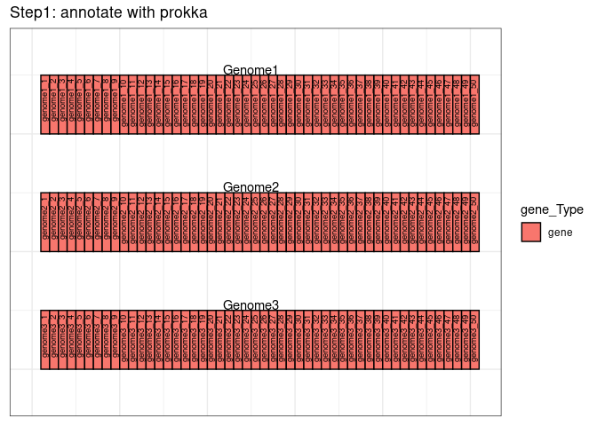
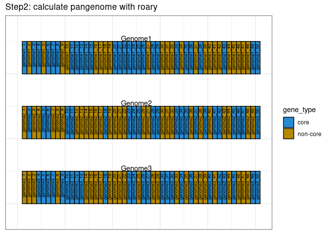
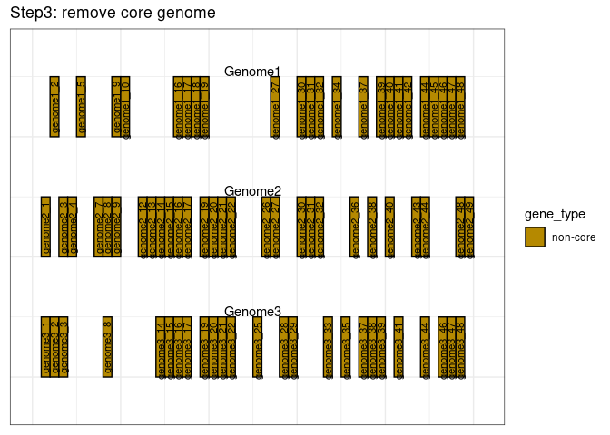
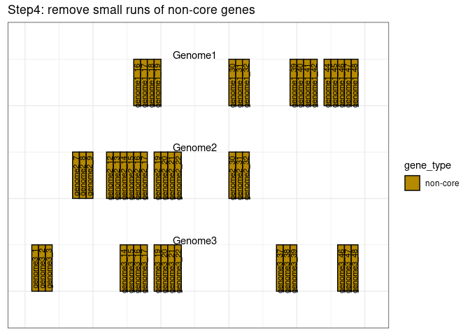
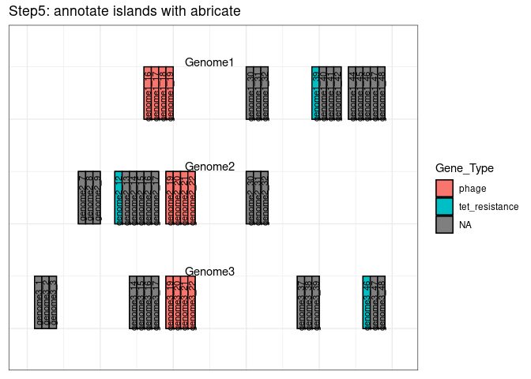
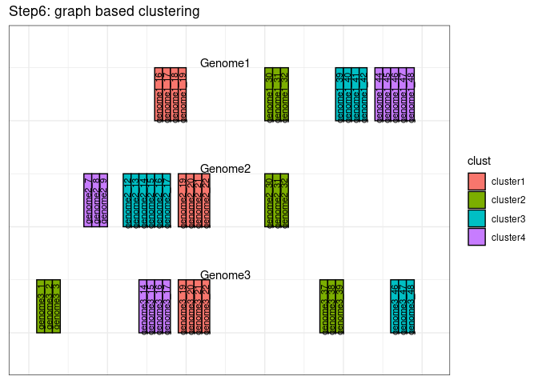

gifrop
================

**G**enomic **I**slands **f**rom **Ro**ary **P**angenomes.

This program is supposed to identify ‘genomic islands’ from roary
pangenomes. The intent was to try and identify units of horizontal gene
transfer within very closely related strains using a pangenome
framework. pangenomic islands?

**Prerequisites:**

1.  A pangenome calculated by roary: Any pangenome should work, even
    those that do not split paralogues (the -s option of roary).

2.  the \*.gff files used by roary to create the pangenome. I have only
    used those produced by prokka but others may work. The increment
    between locus tags must be 1.

If all you have are nucleotide fastas then you can use the included
`pan_pipe` script to take care of the whole pipeline from annotation
with prokka to pangenome calculation with roary to genomic island
extraction with gifrop.

More or less this is a wrapper for exploring roary results.

## conda installation

**create new conda environment**  
`conda create -n gifrop`

**activate new environment**  
`conda activate gifrop`

**install gifrop**  
`conda install -c conda-forge -c bioconda -c defaults gifrop`

or

## manual installation

Install the dependencies and make sure they are in your path:

1)  parallel  
2)  abricate  
    \- You will also need these custom abricate databases
      - <https://github.com/Jtrachsel/megares_db_4_abricate>  
      - <https://github.com/Jtrachsel/viroseqs>  
3)  R 3.6.\* and these R packages:  
    \-
    ‘dplyr’,‘tidyr’,‘readr’,‘tibble’,‘ggplot2’,‘purrr’,‘Biostrings’,‘BSgenome’,
    ‘igraph’, ‘pheatmap’  
4)  roary (if using pan\_pipe script)  
5)  prokka (if using pan\_pipe script)  
6)  make the scripts from this repo available in your path

## Running gifrop

  - Navigate to a directory containing prokka annotated gff files and
    the output of roary, specifically the `gene_presence_absence.csv`
    file.  
  - run gifrop:
      - `gifrop --find_islands --threads 8`  
  - all outputs go to the `gifrop_out` directory.

## pan\_pipe script

The included script ‘pan\_pipe’ is a complete pipeline for extracting
genomic islands from a collection of nucleotide fastas.

These are the basic steps:  
1\) Annotate with prokka  
2\) Calculate pangenome with roary  
3\) Extract genomic islands with gifrop

You are able to pass arguments to prokka, roary and gifrop using quoted
strings of arguments, see `pan_pipe --help` for more information.

## How this program identifies pangenomic islands

1)  **remove the core genome from the pangenome.**
    
      - Currently, this removes any gene that occurs in all isolates
        exactly 1 time. This means that genes that occur twice or more
        in any genome are currently kept for consideration.  

2)  **Identify strings of consecutive genes** (locus tag numbers)  

3)  **Remove strings that contain fewer than the minimum number of
    genes.**
    
      - These remaining strings of consecutive genes are ‘genomic
        islands’ ‘pan-genomic islands?’  

4)  **Classify pangenomic islands** by running abricate with the
    following databases:
    
    1)  [Megares2.0](https://megares.meglab.org/) database (bc it has
        metal tolerance)  
    2)  [plasmid finder](https://cge.cbs.dtu.dk/services/PlasmidFinder/)
        (replicon genes)  
    3)  [vfdb](http://www.mgc.ac.cn/VFs/main.htm) (virulence genes)  
    4)  [ProphET](https://github.com/jaumlrc/ProphET) phage db  

5)  **Cluster pangenomic islands**, this can get messy.
    
      - make a graph where pangenomic islands are nodes and they are
        joined by edges when they share genes with other pangenomic
        islands. The edges of the graph are weighted in proportion to
        the number of genes that are shared by the nodes
      - two levels of clustering:  
        \- primary clustering: any islands that share any number of
        genes will be in the same primary cluster.  
        \- secondary clustering: this applies louvain sp? clustering on
        the graph. This should hopefully help to separate some of the
        more tangled islands.  
        \- problems with clustering: in cases where there are two
        plasmids that are very different but have some shared genes,
        these will often be in the same cluster. I have seen a case
        where the same transposon is inserted into different genomic
        islands and plasmids and then they get all tangled together.
        ANyway, it gets messy so be careful what your inputs are.  

6)  **output pangenomic island info.**  
    All outputs go to the `gifrop_out` folder.  
    main outputs:
    
    ``` 
      1. clustered_island_info.csv  
      2. pan_with_island_info.csv  
      3. pan_only_islands.csv  
      4. figures directory  
         - some basic exploratory figs  
         - heatmaps of the variable secondary clusters (buggy)  
      5. All the pangenomic islands  
         - both fasta format and gffs  
      6. logfiles  
    ```

| file                        | description                                                                                                                           |
| --------------------------- | ------------------------------------------------------------------------------------------------------------------------------------- |
| clustered\_island\_info.csv | This is a csv file that contains a detailed description of every genomic island detected in this pangenome.                           |
| pan\_with\_island\_info.csv | The roary ‘gene\_presence\_absence.csv’ file annotated with information about which genomic islands and clusters the genes belong to. |
| pan\_only\_islands.csv      | The same as the previous file but filtered to only include genes that occur on at least 1 genomic island                              |

## graphical overview:

<!-- --><!-- --><!-- --><!-- --><!-- --><!-- -->

## Known issues

**Draft assemblies**  
gifrop can handle incomplete, draft assemblies, but the genomic islands
it identifies **will never span contig breaks**. That is, if there is a
genomic island in your assembly that is divided across two contigs, it
will be split into 2 different genomic islands.

**Complete genomes**  
If you input complete genomes, (with closed circular chromosomes) and a
genomic island spans the arbitrarily chosen start/end coordinates, it
will be split into two genomic islands.

**Combining of adjacent/nested genomic islands**  
If there is a situation where two distinct genomic islands are inserted
adjacent to one another or one nested within another etc., they will be
treated as one genomic island.

## TODO

1)  link abricate results to pangenome, use coords of hits with gffs to
    get loc\_tags?  
2)  Fix issue with viroseqs abricate db, puts ‘phage’ into resistance
    column.
3)  Include example data?

Suggestions welcome.
